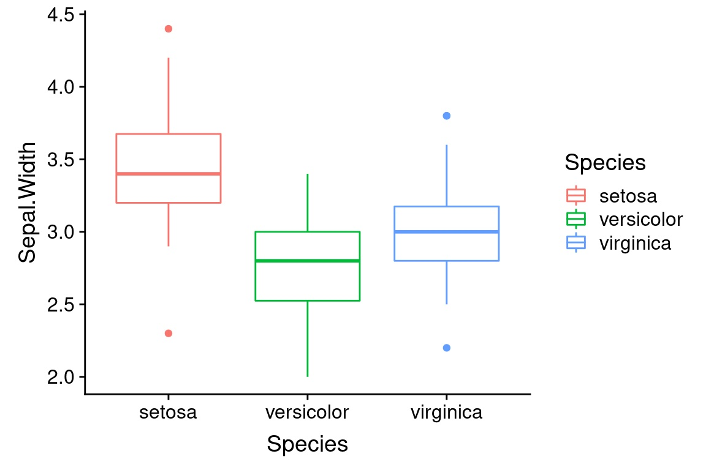
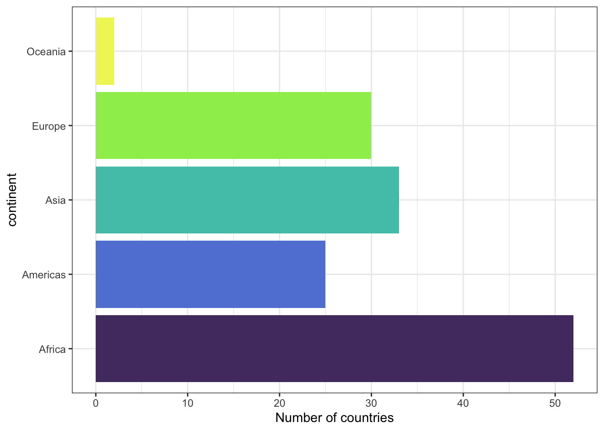
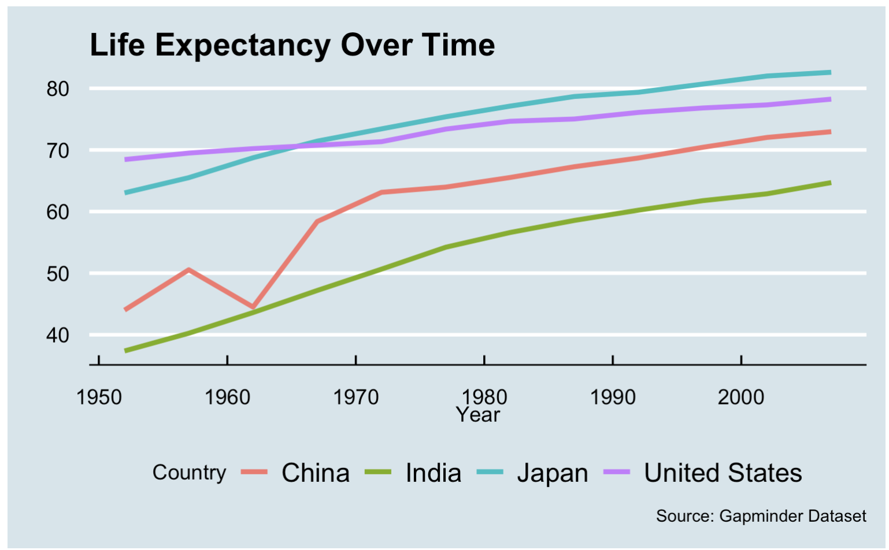
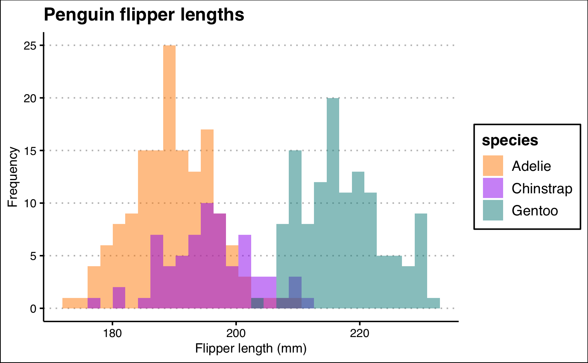

***Please be sure to proofread your rendered document before submitting it***

*In your assignments your answers need to either be written out or include output from your code chunks. Please make sure that the output from your code chunks actually shows up and shows up the way that you want it to. Answers that do not contain the information needed to answer the question will be marked incorrect.*

```{r message=FALSE, warning=FALSE}
#LOAD PACKAGES 
library(tidyverse)
```

Recreate the following plots from the the iris, gapminder, and penguins datasets. Focus your efforts on getting the content correct. If you have time at the end, as a bonus, you can try to match the styling as closely as you can.

# 1: Iris Side-by-Side Boxplot



```{r}
#load the iris dataset
data("iris")
```

# 2: Gapminder Barplot



```{r}
#load the gapminder dataset
library(gapminder)
data("gapminder")
```

# 3: Gapminder Line Graph



```{r}
library(ggthemes) # you might need this to help with the theme... 
```

# 4: Penguins Histogram



```{r}
#Load Penguins Data
library(palmerpenguins)
data("penguins")
```


```{r}
penguins |>
  ggplot(aes(x=flipper_length_mm, fill=species)) +
  geom_histogram(position="identity", 
                 alpha=0.5)


```

# 5: In class exersize

```{r}
library(DAAG)
data("possum")
```

*Copy your work from class in here if you completed this in class. If you didn't get through it, then now's your chance!!! So exciting.*

Choose one numeric variable from the possum dataset. Create two different distribution plots of that variable (choose from: histogram, density, boxplot, violin). Filter for only one of the populations and then compare across a different grouping variable (other than `Pop`).

-   Change the theme
-   Change the colors

Then write 3–4 sentences:

-   What do you see? (Be specific.)
-   What does each plot make clearer?
-   What does each plot hide or distort?

# 6

Did you use AI to help you with this assignment. If so, what did you use, how did you use it, and how do you think it impacted your learning (either positively or negatively)?
