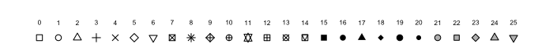

`ggplot2` is a package built within the `tidyverse` package for creating awesome graphs!

```{r}
library(tidyverse)
```

```{r}
#Import the can_lang dataset 
can_lang <- read.csv("https://raw.githubusercontent.com/ttimbers/canlang/master/inst/extdata/can_lang.csv")
```

## Recall our Top 10 example:

This code gave a list of 10 Aboriginal Languages which have the most number of people who speak them as their mother tongue:

```{r}
# code for top 10 aboriginal languages


```

## Barplots with `geom_col`

Suppose we wanted to display this information in a barplot instead of in a table.

```{r}
# start with just ggplot()
# blank canvas

# add data and aes()
# now we have axes but no data

# add data using geom_col


#send in data without using new object

```

Is there any improvements we could make to this graph?

### To better view text

Display the bars horizontally instead of vertically!

```{r}
# switch axes to change orientation

```

This flips the x and y axes!

### Labels, Colors, and Themes

We can alter the labels on our `x` and `y` axes.

```{r}
# add axis labels and plot title

# using labs()

# using xlab() and ylab()

```

::: callout-tip
Barplots are good for displaying one categorical variable and one numeric variable. The number variable could be counts (as above) or they could be averages or totals or maximums or minimums (or many other things!)
:::

We can change both the bar fill colors and outline colors displayed on the figure, by adding the `color` and `fill` arguments to our `geom` function.

```{r}
# change bar colors using color= and fill=

```

We can further control the appearance of our figures with `themes`.

```{r}

# play around with themes

```

You can find visualizations of all of the themes included in the `ggplot2` package [here[(https://ggplot2.tidyverse.org/reference/ggtheme.html). There are additional packages such as the `ggthemes` package that have even more themes. And if you are feeling really fancy, you can make your own custom theme (please don't do this right now).

And then finally we can add a title to the figure using the `ggtitle()` function.

```{r}

# add a title

  
```

## Scatterplots with `geom_point`

The `mtcars` dataset was extracted from the 1974 Motor Trend US magazine, and comprises fuel consumption and 10 aspects of automobile design and performance for 32 automobiles (1973–74 models). It's available inside the `ggplot` package which is already installed.

```{r}
#load the data
data(mtcars)

#what is in the dataset???
#?mtcars

```

::: callout-tip
Scatterplots are good for displaying the relationship between two numerical variables.
:::

### Color and Shape

```{r}
# what should we plot?


```

We can change the shape of the points using the `shape` argument within our `geom_point()` function.

```{r}
# change shape using pch (stands for plotting character)
# ?pch to get available point shapes


```

For reasons that are entirely unclear to me shapes in `R` are referred to as `pch` which stands for plotting character. They are called by number or in some cases name. The `pch` numbers and their corresponding shapes are shown below.




Likewise, we can change the color of our points using the `color` argument within our `geom_point()` function.

```{r}

# change color outside of aes()

```

In `R` you can call colors by name or by hex code. Named colors can be found [here](https://sape.inf.usi.ch/sites/default/files/ggplot2-colour-names.png). A decent hex code color picker can be found [here](https://www.google.com/search?si=APYL9bso3UJ9cquV6V3y0lV9aI-1cRk1OqzkBH0KgGgZLiu3ba8hjNTbhnD5Pi_XgwgBHeeVuUt-naBE1cRLOF3L6MR58QuyhvRFHViIX1eLqdjTdC17wrFZvfXNbO_KOxpHgL2qpgnJBv79-AZAE-ius-JZpybSemkZcHwzUIxEME_6fvfM3-uzj0eiI7rd837kl593saM0uTVi9ggRV0v4sUr9Rgz8Y02QpR9I30JdgGj_iIiUNYZACSm45xDbXsc9KH_UklU0E7d_CuP2DagmI9P1-4jHMqAajeoP5MeYG20DwiKEyUYgsiCe81u_jPoYPUHItkSZuqIRaiwWZuej-tHglnX6Hy84c_JNvLQW6RvCzs24ikK4lB2wCeyQohnr-e0DVR9vhlNiWftHQTCXEL5z--kDxQF7sED47K5zhJRwnwyfDTeZTwZqudbOOZstJyIWqg4tzxfNPkCh2XUnOs2u0bkrOlj2i_YfFwAnuTXxpBUoFumNUl8trBjt5X6OV4vChSqnK6t9FF2nT1Esv0-FckpFDyFIhQ8aKW6N_JOHSumQULZQQk0FfcpGsZsTPyst7Pxe&hl=en-US&shndl=21&source=sh/x/fbx/m1/1&fbxst=CgkKByMzMmE4NTI&kgs=595ca84015806d69).

#### Quick update to the dataset

```{r}
#code to update `mtcars` dataset so that `am` is treated as a factor rather than a continuous numeric variable
# used mutate and as.factor() to add column to existing dataset called am_factor


```

This modifies the `am` column, which represents the transmission type of the car (0 = automatic, 1 = manual). The `as.factor(am)` function converts the am variable from a numeric type (0 or 1) into a categorical factor.

```{r}
# what is a factor and how does it change the plotting?

#plot using normal am


#plot using am_factor


```

### Customizing Colors in Aesthetics

You can customize the colors that you use for both discrete/categorical variables and continuous variables using the `scale_color_manual()` and `scale_color_gradient()` functions, respectively. 

First we are going to take a look at how to define colors for a discrete variable using the `scale_color_manual()` function and the `am_factor` variable that we created above which takes on the value of either 0 or 1.

```{r}
# for discrete variables using scale_color_manual()
# ggplot(mtcars, aes(x=wt, y=mpg)) +
#   geom_point(aes(color=am_factor)) +
#   scale_color_manual(values=c("black", "orange")) 


```

Now let's take a look at how to do this for a continuous variable using the `scale_color_gradient()` function that you should already have access to with the packages that you have loaded.

```{r}
# for continuous variables
# without loading in new library
# scale_color_gradient(high=, low=)
# scale_color_gradient(low  = "lightblue",high = "darkblue")


```

There are lots of ways to control the colors and palette and we will get into how to operate more of those controls in a few classes.

::: callout-tip
-   Use `scale_color_manual()` when assigning colors to categorical variables.
-   Use `scale_color_gradient()` when assigning colors to continuous variables.
:::

## Global vs. Local Data and Aesthetics

Where you define your input data and `aes()` matters. Global aesthetic mappings apply to all geometries and can be defined when you initially call `ggplot()`. All the geometries added as layers will default to this mapping. Local aesthetic mappings add additional information or override the default mappings.

```{r}

#local variables
# geom_line() does not know about the data defined in geom_point()

# global variables
# if we define data and aesthetics in ggplot() every subsequent geom tht we call will know about them

```

::: callout-tip
-   If the thing you are trying to change (color, shape, size, etc.) depends on a variable, you should put in *inside* the aesthetics
-   If the thing you are trying to change (color, shape, size, etc.) should happen for all things, you should not put it inside the aesthetics.
:::

```{r}
#color = qsec as a global aesthetic 
# set color gradient using scale_color_gradient()


```

```{r}
#color = qsec as a local aesthetic
# set color gradient using scale_color_gradient()


```

```{r}
# overwriting color = qsec as a global aesthetic with a local aesthetic in geom_point()


```

## In-Class Excercise:

### Plot 1

Create a scatterplot using `geom_point()` to explore the relationship between engine displacement (`disp`) and horsepower (`hp`) in the `mtcars` dataset. In addition to plotting these two numeric variables, *map a third numeric variable* of your choice to color. Apply a non-default continuous color scale using `scale_color_gradient()`, and include a clear title, axis labels, and a non-default theme. After creating your plot, write 2–3 sentences describing the pattern you observe between displacement and horsepower.

```{r}


```

### Plot 2

Now extend the story by investigating a different relationship in the dataset. Choose two numeric variables other than `hp` and `disp` that you think might help explain fuel efficiency or vehicle performance, and create a new scatterplot using `geom_point()`. Convert one relevant grouping variable (such as `am`, `cyl`, or `gear`) to a factor and map it to color. Apply a non-default discrete color scale using `scale_color_manual()`, and include a clear title, axis labels, and a theme. In 2–3 sentences, explain why you chose these variables and what you observe in the plot.

```{r}

```
